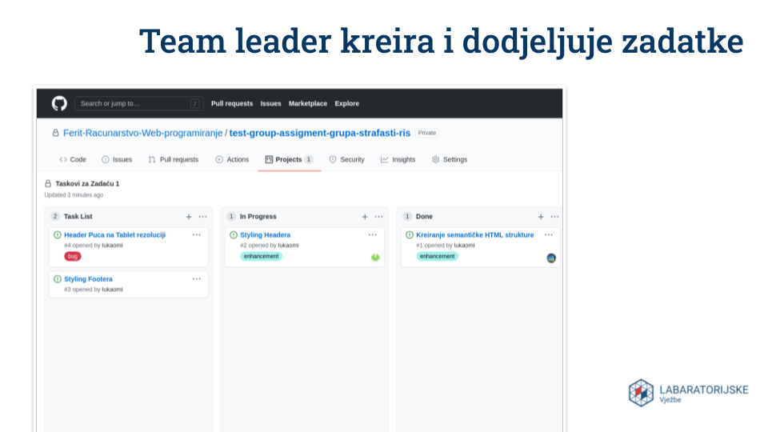
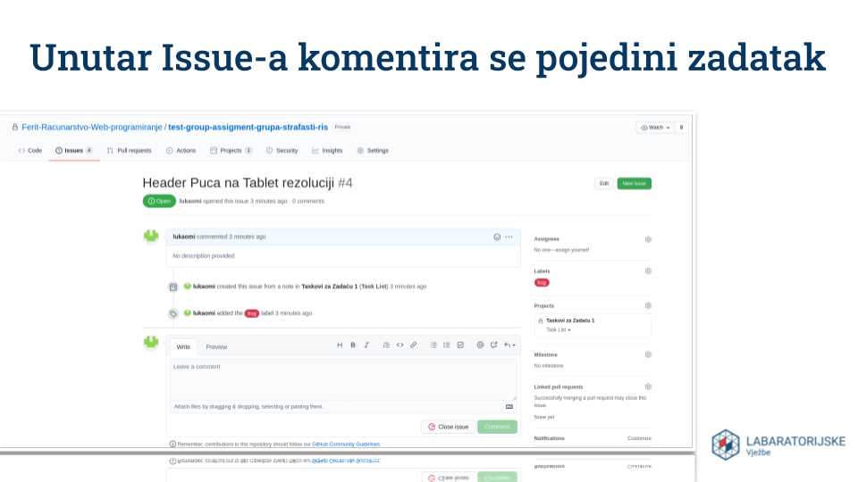
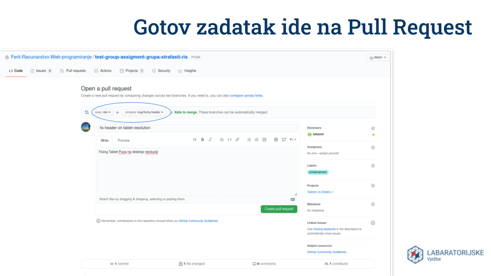
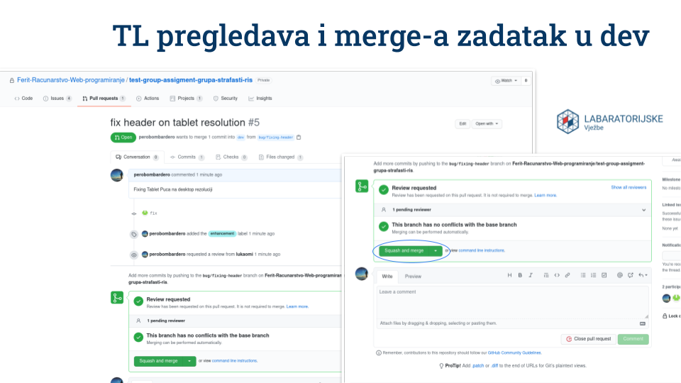
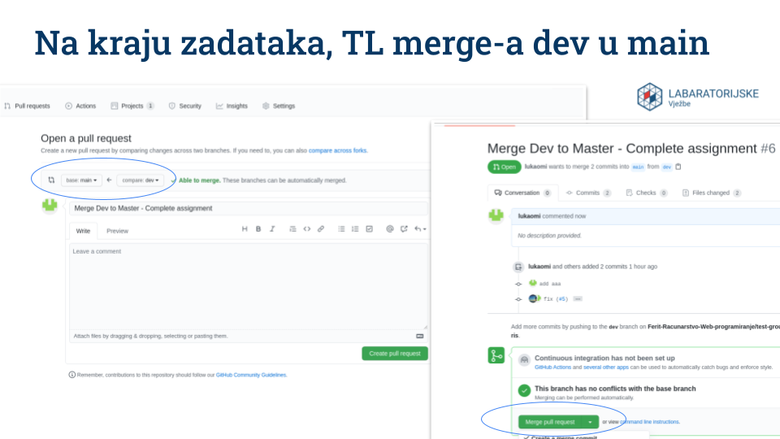

# 003 - Git

#### Git workflow (za početak)

- https://guides.github.com/introduction/flow/

#### Branching model po kojemu radimo na LV-u (main i dev grane): 

- https://nvie.com/posts/a-successful-git-branching-model/

#### Korisni Linkovi

- Levara_XYZ (git tutorial na HR) [Link](https://www.youtube.com/watch?v=a0fgOeEpE74&list=PLDKea8VEeLQNtn__lG_TDqwhlGhoutWym&index=1)

- https://learngitbranching.js.org/

#### Koraci rada unutar repozitorija grupne zadaće

- Student se odvaja iz dev grane i radi svoj zadatak. Kada završi radi pull request za spajanje svog zadataka na dev granu.

- TL pregledava napravljeni rad i prihvaća ga ukoliko je sve uredu. Može odbiti ili tražiti naknadne promjene. Kada merge-a u dev granu obavezno mora raditi Squash and Merge kako bi "skupio" sve commitove u jedan glavni commit koji će se nalazit unutar dev grane.

- Kada su svi zadatci gotovi TL radi pull request na master koji predstavlja produkciju. Prilikom Merge-a radi klasični merge (Merge pull request).
